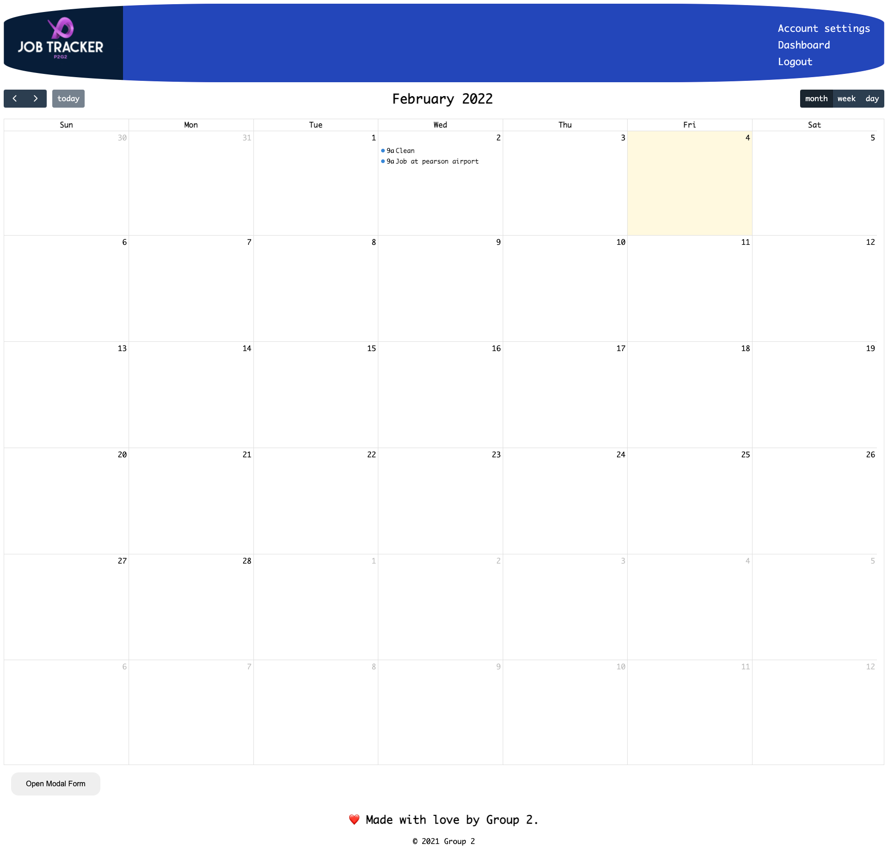
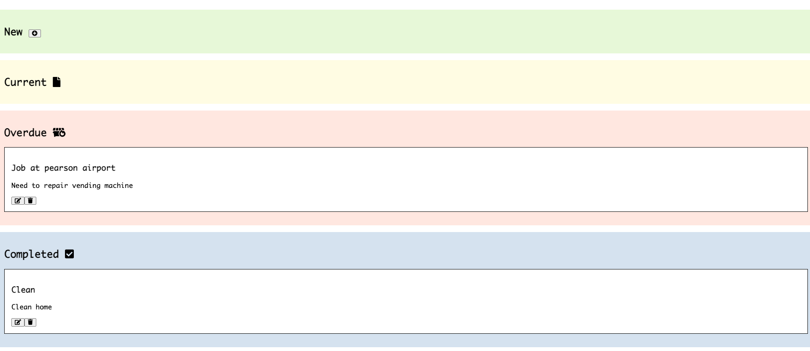

# P2G2 JobTracker

## Table of Contents

## Screenshot and live URL

[URL to live app](https://safe-cove-20593.herokuapp.com/)

---

- [Description](#description)
- [Installation](#installation)
- [Usage](#usage)
- [Technologies](#technologies)
- [License](#license)
- [Contributions](#contributions)

---

## Description

An application that allows a group or company to create, organize and view tasks as the well as the tasks of their fellow employee's

## Installation

In order to use this, Node.js and mySql are required.

Open your Command Line Interface and go to the root directory of this project and type `npm install` to install the dependencies. Afterwards, type `npm run start` in order to start the server

## Usage

Go to your web browser and type `localhost:3001` and you will be brought to the login page

After choosing your username and password and clicking on the signup button, an alert will confirm that your account has been created

After you've logged in you will be taken to the calendar page, here you can click on the `Add Task` button on the bottom of the page and then you can add the task or job you need to do, a date which will be in the following format, `YYYY-MM-DDT15:00:00` (_where 15:00:00 stands for 3pm_), and a description of the job

After submitting the task details, an alert will let you know that it has been created and you will be able to see it on the calendar, if you hover over the task then a tooltip with the description will appear and if you click on it then you will be directed to a kanban board with all of the task descriptions on it which you can drag and drop to the appropriate status column and it will persist even if you refresh the page

You can navigate between the calendar, kanban and account settings page through the links on the top right

On the account settings page you will see your current information and a form to be able to change your password (_Not functional as of yet_)

You can logout by pressing the `logout` button on the top right of the page

## Technologies

- HTML
- CSS
- JavaScript
- Node.js
- Express.js
- Express.handlebars
- mySql
- fullCalendar

## License

---

## Contributions

Adam Campeau, Bianca Chami, Daniel Arzanipour, Jie Wei, Pawanpreet Kaur, Vincent Nguyen

---
